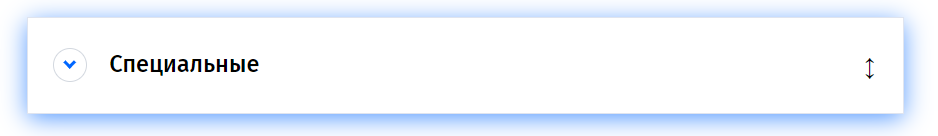

# Drag and drop - without browser API, using only mouse ivents


## About 🔍


List of items, which include categories and subcategories.

You can move any items on another place (change order of categories, change order of subcategories).

it's `smooth`!

## Usage 🕹️

1. Click on category to expand/hide subcategories

   > Smooth expand worked by max-height:
   >
   > ```
   > parentElement.style.max-height: 0
   > ```
   >
   > ```
   > parentElement.style.max-height: scrollHeight + 'px'
   > ```

2. Grab category and change with another category

   > Hover on two-ways arrow, move category under another one category
   >
   > You can see the blue line - it's place for dropping!
   >
   > Then drop category (worked by before\after) onto that.

3. Grab subcategory and change with another subcategory (you can drop it at current category, or any category else)

---

### 🖼️ Screenshots

<details><summary>Categories</summary>


</details>
<details><summary>Categories opened</summary>


</details>
<details><summary>Dragged element - box-shadow</summary>



</details>
</details>
<details><summary>Highlight line</summary>


</details>

---

### 🫠👁️ Little notes! 👁️

Be notice - drop element available **only if you move youre coursor inside of element below** (not when you move youre coursor away from element below... (シ\_ \_)シ )

---
